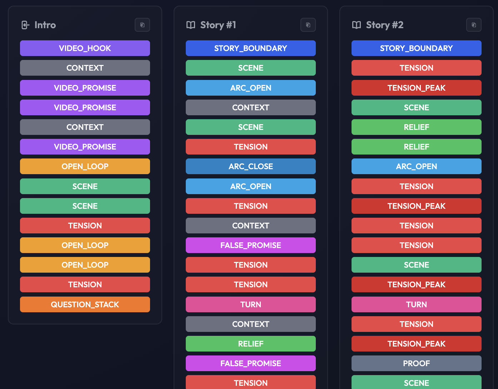

# Storytelling Structure Extractor

A local tool for breaking down long-form video scripts into a reusable narrative structure. Paste or upload a script, and the app labels each passage with functional storytelling tags, groups them into stories, and produces a compact pattern you can compare across videos.



Built for multi-story formats — “top N” compilations, documentary anthologies, list-style YouTube essays — where one video contains several self-contained arcs under a shared intro and outro.

## What it does

1. **Segments the script** — splits raw text into labeled blocks (hook, open loop, tension, payoff, transition, etc.).
2. **Builds a narrative tree** — detects story boundaries, sub-arcs, and video-level framing.
3. **Extracts a structure template** — intro, individual stories, and outro as sequences of tags, without the original wording.

The output is meant for analysis and reuse: study how successful videos are paced, spot recurring patterns, and draft new scripts against a proven structure.

## Typical workflow

- Upload a `.txt` script, drop a file anywhere on the page, or paste text directly.
- Optionally attach a source note or URL (e.g. the original YouTube link) for your reference library.
- Review the result in the browser; download `structure.json` when processing finishes.
- Browse past runs in local history; edit titles and sources as needed.

Pre-segmented `.json` files can be uploaded to skip the AI step and run only tree building and structure extraction.

## Setup

```bash
pip install fastapi uvicorn openai python-multipart
```

Set an OpenAI API key via `OPENAI_API_KEY` (environment variable or `storytelling/.env`). If none is configured, you can enter a key in the web UI for the current browser session.

From the `storytelling` directory:

```bash
python3 main.py
```

Open `http://127.0.0.1:8000`.

## Inputs and outputs

**TXT** — plain script text; chunked and segmented automatically.

**JSON** — existing segmentation as a list of blocks or `{ "blocks": [...] }`, each block with at least `text`, `tag`, and related metadata.

**Stored per task:**

| Artifact | Purpose |
|----------|---------|
| `segmented_blocks` | Full labeled segmentation with text and model reasoning |
| `tree_json` | Hierarchical narrative tree |
| `structure_json` | Downloadable tag pattern (intro / stories / outro) |

Downloaded `structure.json` contains only abstract tag sequences — no source text or hover details.

## Project layout

- `main.py` — web app, API, and UI
- `pipeline/taxonomy.py` — tag definitions
- `pipeline/segmenter.py` — AI segmentation
- `pipeline/chunker.py` — text chunking
- `pipeline/tree_builder.py` — narrative tree
- `pipeline/structure_extractor.py` — structure template

Pipeline scripts can also be run standalone from the command line; the web UI is the primary entry point.
